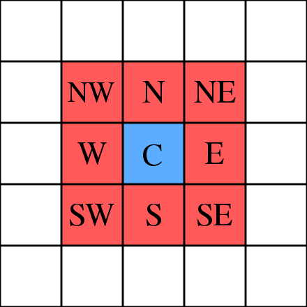

Conway's Game of Life

The universe of the Game of Life is an infinite, two-dimensional orthogonal grid of square cells, each of which is in one of two possible states, live or dead (or populated and unpopulated, respectively). 
Every cell interacts with its eight neighbors, which are the cells that are horizontally, vertically, or diagonally adjacent. 

At each step in time, the following transitions occur:

    Any live cell with fewer than two live neighbors dies, as if by underpopulation.
    Any live cell with two or three live neighbors lives on to the next generation.
    Any live cell with more than three live neighbors dies, as if by overpopulation.
    Any dead cell with exactly three live neighbors becomes a live cell, as if by reproduction.

The initial pattern constitutes the seed of the system. The first generation is created by applying the above rules simultaneously to every cell in the seed, live or dead; births and deaths occur simultaneously, and the discrete moment at which this happens is sometimes called a tick. 
Each generation is a pure function of the preceding one. The rules continue to be applied repeatedly to create further generations. 
Note:  The simultaneity means that when each cell counts the number of live neighbors around it, it uses its neighbors' old states before the update, not their new states after the update.

Sources:
Wikipedia - https://en.wikipedia.org/wiki/Conway%27s_Game_of_Life
https://playgameoflife.com/info

https://mathworld.wolfram.com/CellularAutomaton.html

https://plato.stanford.edu/entries/cellular-automata/#fig1

https://github.com/halimb/gol/blob/master/script.js#L206

heatmap d3: https://observablehq.com/@observablehq/plot-simplified-calendar

good explanation: https://www.theguardian.com/science/alexs-adventures-in-numberland/2014/dec/15/the-game-of-life-a-beginners-guide

